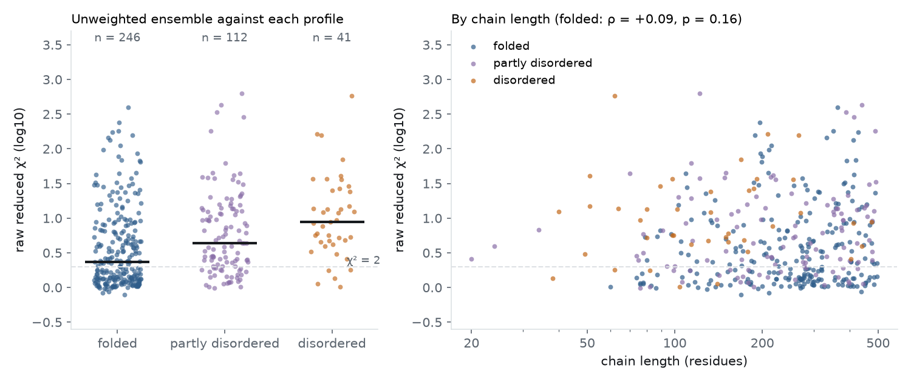

# bioemu-saxs-campaign

**Where does BioEmu-1 disagree with solution scattering, and which proteins should be measured next?**

Project page: <https://natalija-stepurko.github.io/bioemu-saxs-campaign/> · design: [`docs/DESIGN.md`](docs/DESIGN.md) ·
campaign proposal: [`docs/CAMPAIGN.md`](docs/CAMPAIGN.md)

## Result

Scored without reweighting against 399 quality-filtered small-angle X-ray scattering (SAXS) profiles from
SASBDB that have a BioEmu-1 ensemble, 37% of the raw ensembles meet the χ² ≤ 2 threshold (146 of 399; 95%
interval 32–41%). The median raw χ² is 2.3 for folded proteins, 4.3 for partly disordered and 8.9 for
disordered; under NRMSD, a second score that does not weight by the reported errors, the three class
medians are similar (0.030, 0.034, 0.031), while the ordering of the seven models in the PeptoneBench
archive is unchanged, with BioEmu-1 first. Reweighting each ensemble towards its profile sorts the entries
into 146 raw fits, 65 modestly reweightable, 91 strongly reweightable and 97 whose target fit is not
reached by the tested procedure. One expectation came out in the opposite direction: BioEmu-1's
disordered ensembles are too extended (median radius of gyration 1.21 times the measured value, interval
1.12–1.28), and the Cα coordinates of the sampled conformers give 1.35, so the extension is present in the
conformers. The raw error is not predictable before measuring (R² = 0.05 in sequence-grouped
cross-validation); ranking held-out entries by predicted error gives a high-discrepancy target yield of
0.58 among the top ten against 0.48 for random choice, within the spread of a single random pick. The priority score
proposed in the design does no better than random choice when fed pre-measurement quantities, so it is not
used to recommend measurements. The campaign proposal therefore has a replication arm, systems chosen by
stated eligibility rules, under standardised conditions and a prospective test of the extension
bias with pre-specified model-based selection and scaling-law-matched controls.



## What was done

All inputs are public: the 439 profiles with sequences and disorder scores (PeptoneDB-SAXS, curated from
SASBDB) and the BioEmu-1 ensembles with their Pepsi-SAXS back-calculated curves generated by the
PeptoneBench authors (Zenodo record 17306061, CC-BY 4.0; archives `PeptoneDBs.tar.gz` and
`Predictions.tar.gz`, md5 verified against the record, sha256 recorded in `data/checksums.json`). The
ensembles were generated with BioEmu at code commit ac7455d; the archive does not record the checkpoint
version, and re-sampling with the current v1.2 checkpoint is the first follow-up
(`notebooks/bioemu_resample.ipynb` prepares it). This study does not re-sample the model; it re-analyses
that output. Each raw fit scales the ensemble average to the data with one factor and one constant
background. A Guinier fit gives the experimental radius of gyration and flags aggregation. Maximum-entropy
reweighting along a path of prior strengths gives, per entry, the effective sample fraction that must be
spent to reach a given fit. Entries whose measured molecular weight exceeds 1.6 times the sequence mass
are excluded as oligomers. Four expectations were written down before scoring (DESIGN §5); one was met, one
reversed, two not met. The additions made after the first run are listed, dated, in DESIGN §7.

## Pipeline

| Stage | Does |
|---|---|
| `bsc fetch` | downloads the two Zenodo archives, verifies their md5 against the record, records sha256, unpacks the SAXS data and the back-calculated curves of the chosen models |
| `bsc score` | per entry × model: raw χ², the error-free NRMSD score, Guinier Rg (experiment and ensemble), reweighting path, data-quality flags |
| `bsc coordrg` | Cα radius of gyration of the BioEmu-1 conformers for every clean disordered entry and 40 random folded ones; `-- --archive Predictions.tar.gz` extracts the missing ensembles in one pass |
| `bsc analyse` | error map by class, the four expectations, the four kinds, model comparison, the design's priority score (reported and tested, not used to select systems), bootstrap intervals, near-duplicate clusters, NRMSD orderings |
| `bsc select_eval` | retrospective evaluation of the selection rule on held-out folds grouped by sequence cluster |
| `bsc predict` | can the error be predicted before measuring: grouped, repeated cross-validation of baselines, linear models and small trees |
| `bsc envelopes` | DENSS ab initio envelopes of the three worked examples and a ribbon rendering of the highest-weight conformer inside each (needs the DENSS environment and a Python with playwright, see below; skipped with a notice otherwise) |
| `bsc report` | figures, `docs/CAMPAIGN.md` and the campaign arms from `results/` |

`python3 docs/site/build.py` builds the project page from `results/`; it stops if the prose and the numbers
disagree, including every sentence that states a direction or a comparison.

## Reproduce

```bash
uv sync --locked --group dev
make test                                # pytest, synthetic data, offline
uv run bsc fetch                         # ~16 GB download from Zenodo; ~2 min to unpack what is needed
make all ARCHIVE=data/archives/Predictions.tar.gz    # every stage after the download, then the page
make page                                # the page alone, from the tracked results/
```

`BSC_ROOT` moves data and results elsewhere; `bsc fetch -- --archive-dir DIR` reuses archives already
downloaded; `BSC_N_JOBS` sets the worker count (default 4). The tracked `results/` (per-entry scores,
reweighting paths, kinds, candidates, coordinate Rg, the validation outputs, the DENSS fit statistics and
the figures) let `analyse`, `select_eval`, `predict`, `report` and the page rebuild without the download.

### The DENSS environment

DENSS (Grant 2018) needs numpy < 2, so it lives in its own virtual environment; `bsc envelopes` looks for
it at `BSC_DENSS_ENV` (default `/scratch/.venv-denss`) and runs `denss-all` from there, ten maps in FAST
mode per example with Dmax from the SASBDB record. Without that environment the stage prints a notice and
`bsc report` keeps the tracked `fig_examples.png`.

```bash
python3 -m venv /scratch/.venv-denss && /scratch/.venv-denss/bin/pip install "numpy<2" denss
BSC_DENSS_ENV=/scratch/.venv-denss uv run bsc envelopes
```

The reconstructions themselves (`results/denss/`) are not tracked; `results/denss_stats.json` keeps their
fit statistics.

### The ribbon rendering

After the reconstructions, `bsc envelopes` docks the highest-weight conformer into each averaged map by
principal axes, writes it as PDB with HELIX/SHEET records from DSSP (mdtraj), and renders the cartoon with the
envelope isosurface in 3Dmol.js (loaded from cdnjs) inside headless Chromium. Chromium is driven by
playwright from the interpreter named in `BSC_RENDER_PY` (default: the project interpreter, if it can import
playwright); without one the step prints a notice and `bsc report` keeps the tracked `fig_examples.png`.

```bash
python3 -m venv /path/to/pw && /path/to/pw/bin/pip install playwright && /path/to/pw/bin/playwright install chromium
BSC_RENDER_PY=/path/to/pw/bin/python uv run bsc envelopes
```

## What is tracked and what is not

Tracked: everything under `results/` except the DENSS maps, and the documents. Not tracked: the Zenodo
archives and the unpacked curves and ensembles (`data/`, rebuilt by `bsc fetch` and `bsc coordrg`),
because they are already public under CC-BY 4.0 and are large.

## Licence

MIT for the code. The inputs keep their own licence (CC-BY 4.0, Invernizzi et al. 2025; SASBDB data as
deposited).

## Cite

```bibtex
@misc{stepurko2026bioemusaxs,
  author = {Stepurko, Natalija},
  title  = {Where does BioEmu-1 disagree with solution scattering, and which proteins should be measured next?},
  year   = {2026},
  url    = {https://github.com/Natalija-Stepurko/bioemu-saxs-campaign}
}
```
